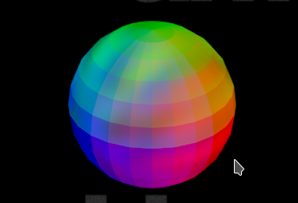
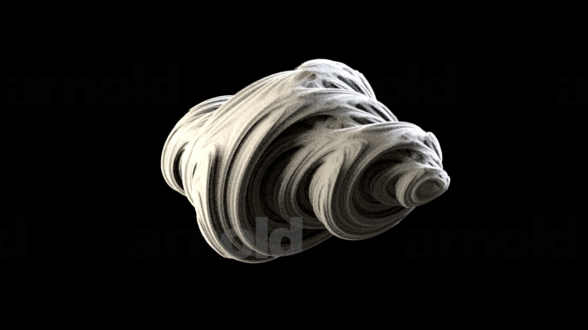

# mrAiVEXShader

CVEX shader and CVEX volume procedural for Arnold. Allows you to generate colors and volume density using the full power of Houdini's VEX language.

## Prerequisites
An installation of Houdini.

## Compilation
1. Get the Arnold SDK for your system and Arnold version from [SolidAngle](https://www.solidangle.com/arnold/download/) and put it in `deps`.
2. Adjust the path to match your Arnold SDK and Houdini versions in `compile.sh` / `compile.bat` (depending on your system, you just need to modify the .bat (Windows) or .sh (everywhere else))
3. Run the script for your OS from the command line
4. Copy the resulting `vexrgb.dll/.so/.dylib` and `vexrgb.mtd` file for to your `ARNOLD_PLUGIN_PATH`.
5. Copy `vexvolume.dll/.so/.dylib` to the `dso` directory in your Arnold installation (or wherever your Arnold looks for procedurals). It's easiest to put it somewhere in your `ARNOLD_PLUGIN_PATH` and add `[ARNOLD_PLUGIN_PATH]` to the *Procedural Path* in the System section of your Arnold settings.
5. Install the HDAs to your Houdini (e.g by copying them to your `HOUDINI_PATH` or `HOUDINI_OTLSCAN_PATH`.
6. Start Houdini with Arnold and have some fun. (It's theoretically  possible to use this without Houdini, but you will probably use it to author the CVEX shaders anyway.)

For the 

## Examples
Ng modulated by some Houdini noise:

A fractal volume (quaternion Julia fractal) generated with a CVEX shader:

